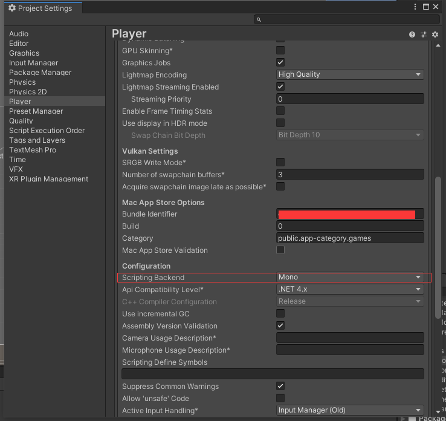
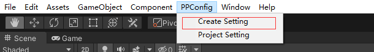
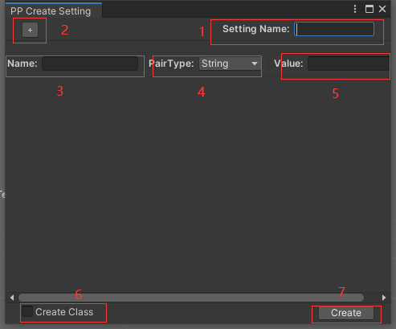
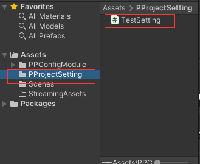
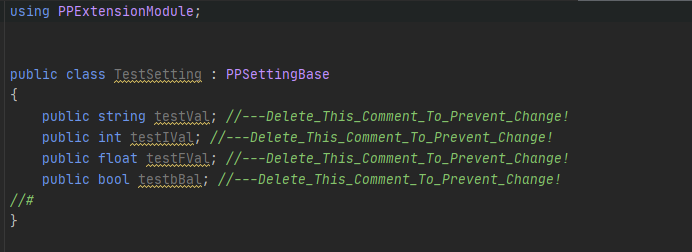
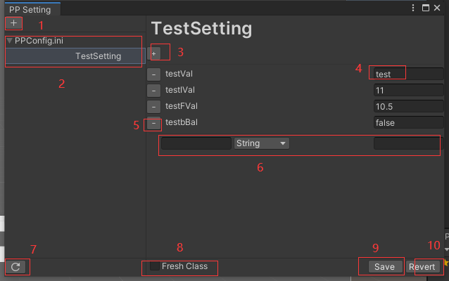

# PP Config Module v1.1

Config 扩展是一个支持在PC以及安卓中使用的配置表和项目设置的扩展模组，包含项目设置以及项目配置两个核心模组构成，还包含了一个简单的编辑器可视化项目配置。

## Getting started with your own project

### 项目配置

将文件夹直接放入到ProjectFolder/Assets/中进行使用。安卓项目中如果需要使用Setting模块，请在ProjectSetting->Player->OtherSettings->Configuration->ScriptingBackend中选择Mono,暂时不要使用IL2CPP。Setting功能的导入是使用了c#的反射机制进行配置表数据导入，IL2CPP无法正确将配置数据注入到项目设置中。

### Config使用

请在[这里](PPConfigModule/ConfigCore/README.md)查看Config的使用方式。

### Setting使用

请在[这里](PPConfigModule/SettingCore/README.md)查看Setting的使用方式。

## 编辑器扩展

### 创建新项目设置

+ 菜单栏中选择PPConfig->CreateSetting打开创建配置页面。

    

+ 页面显示:

    

    >1.输入需要创建的设置类型（名称）
    >
    >2.新增设置变量（键值对）
    >
    >3.变量名(键名)
    >
    >4.变量类型,四种类型Integer,Single(float),String,boolean，根据变量类型在创建对应.cs文件的时候会创建对应的变量
    >
    >5.变量值
    >
    >6.是否创建对应设置类，勾选后会在项目内创建对应的同名称类.cs文件
    >
    >7.文件选择对话框中设置保存名，数据会写入到文件中。

    

+ 生成类文件使用和编辑

  

  >生成的.cs文件中，每次更新会依据//#符号进行后续添加,根据变量后的注释进行修改删除。如果希望不改变类中的文件，可以删除掉后面的注释，如果希望对类新增变量和函数，可以在//#注释符号后一行进行添加。生成的类可以在项目设置模块中进行生成获取保存。

### 项目设置页面

+ 菜单栏中选择PPConfig->Project Setting打开项目设置页面。

    

    >1.创建新的设置，打开创建新设置窗口
    >
    >2.选择对应配置文件中的对应配置段落
    >
    >3.新增变量，与创建配置中使用方式一致
    >
    >4.修改变量值，如果使用了Setting加载需要和Setting类型一致。
    >
    >5.删除变量
    >
    >6.新增变量行
    >
    >7.如果在外部修改配置表文件或者增加删除了配置表文件，可以进行刷新
    >
    >8.当修改变量数量(增加或者删除)时会出现选项，是否刷新对应的类文件，如果不存在会进行创建。
    >
    >9.保存配置到配置表文件中
    >
    >10.还原没有保存的修改
