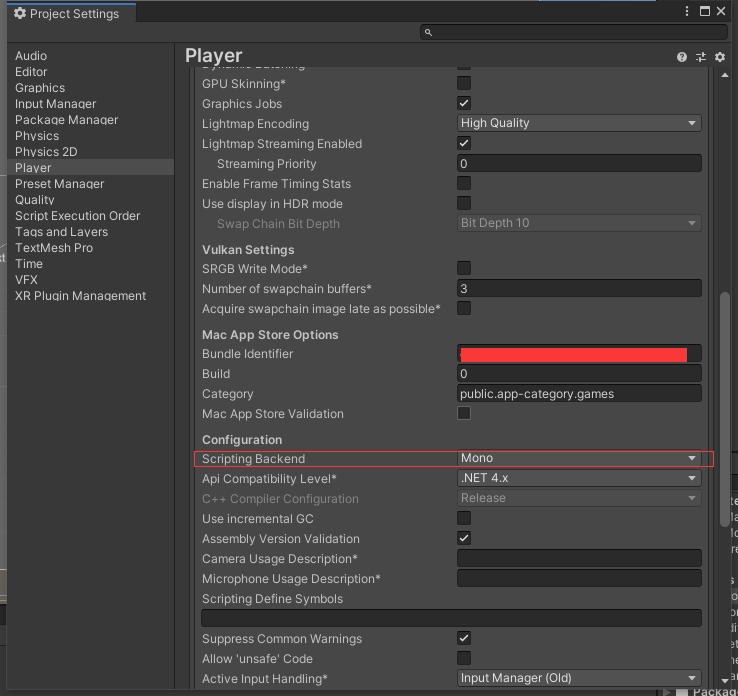
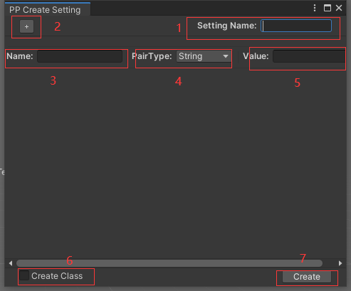

# PP Config Module

The config extension is an extension module that supports configuration tables and project settings for use in PC and Android. It consists of two core modules: project settings and project configurations, and also includes a simple editor to visualize project configurations.

## Getting started with your own project

### Project Setting

Put the folder directly into ProjectFolder/Assets/for use. If you need to use the Setting module in an Android project, please select Mono in ProjectSetting Player OtherSettings Configuration ScriptingBackend and do not use IL2CPP for now. The import of the Setting function uses the reflection mechanism of c # to import configuration table data, and IL2CPP may not be able to correctly inject configuration data into project settings.

### Use Config module

Please check the usage of Configuration [Here](PPConfigModule/ConfigCore/README_EN.md).

### Use Setting module

Please check the usage of Setting [Here](PPConfigModule/SettingCore/README_EN.md).

## Editor Extensions 

### Create Setting

+ Select PPConfiguration ->Create Setting from the menu bar to open the Create Configuration page.

    

+ Page Show:

    

    >1.Enter the type (name) of setting that needs to be created.
    >
    >2.Add setting variables (key value pairs).
    >
    >3.Variable name (key name)
    >
    >4.Variable types, four types: Integer, Single (float), String, and Boolean. Depending on the variable type, corresponding variables will be created when creating the in *.cs file
    >
    >5.Defualt variable value in config file.
    >
    >6.Do you want to create a corresponding setting class? After checking, a corresponding named class. cs file with the same name will be created within the project.
    >
    >7.Set a save name in the file selection dialog box, and the data will be written to the file.

    

+ Generate class file usage and editing.

  

  >In the generated CS file, each update will be followed by subsequent additions based on the //# symbol, and modifications and deletions will be made based on the comments after the variables. If you want to not change the files in the class, you can delete the comments at the end. If you want to add variables and functions to the class, you can add them on the line after the//# comment symbol. The generated classes can be generated, retrieved, and saved in the project settings module.

### Setting Page

+ Select PPConfiguration ->Project Setting from the menu bar to open the project settings page.

    

    >1.Create new settings and open the Create New Settings window.
    >
    >2.Select the corresponding configuration paragraph in the corresponding configuration file.
    >
    >3.Add new variables, consistent with the usage in creating configurations
    >
    >4.Modify the variable value. If Setting is used for loading, it needs to be consistent with the Setting type.
    >
    >5.delete variable.
    >
    >6.add a new variable row.
    >
    >7.If the configuration table file is modified or added or deleted externally, it can be refreshed.
    >
    >8.When modifying the number of variables (increasing or deleting), an option will appear to determine whether to refresh the corresponding class file. If it does not exist, it will be created.
    >
    >9.Save configuration to configuration table file.
    >
    >10.Restore unsaved modifications.
